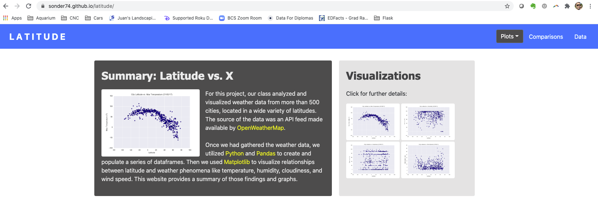
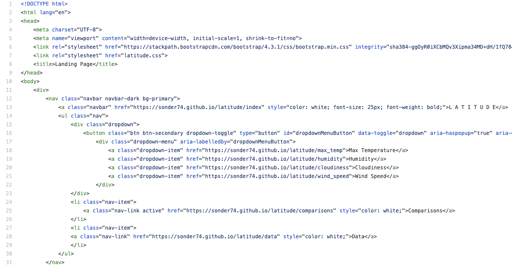
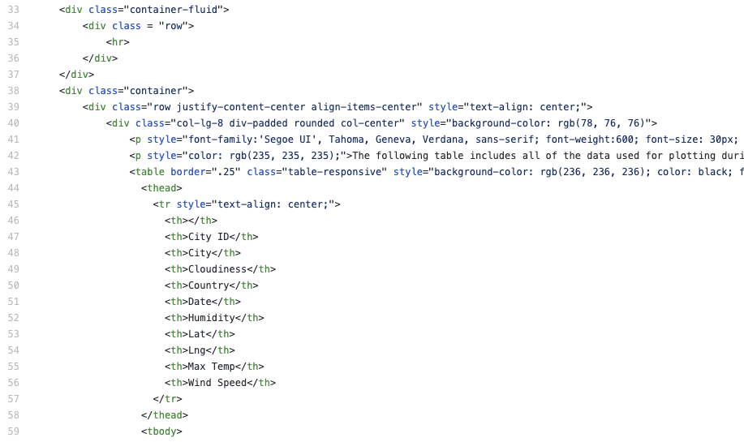

# Web Design Challenge (Grade: A+)
 
### Table of Contents:

 1. [Project Goals](#project-goals)
 2. [Tools and Solutions](#tools-and-solutions)
 3. [Outcomes and Lessons Learned](#outcomes-and-lessons-learned)
 4. [Coding Screenshots](#coding-screenshots)
   

## Project Goals
With this project, I was finally able to try my hand at some web design, using <a href="https://en.wikipedia.org/wiki/HTML">HTML</a> and <a href="https://en.wikipedia.org/wiki/CSS">CSS</a> to bring the data from <a href="https://github.com/sonder74/web-scraping-challenge">a former assignment</a> to life. My goal was to produce a clean, communicative website featuring visualizations related to global weather patterns.

## Tools and Solutions
After receiving classroom instruction on the uses of HTML and CSS, I had to learn to utilize <a href="https://getbootstrap.com/">Bootstrap</a>, an open-source CSS framework that can speed up the web-design process and make finished sites responsive to the devices accessing them. I also had to return to both <a href="https://www.python.org/">Python</a> and <a href="https://pandas.pydata.org/">Pandas</a> in order to generate an dynamic table embedded in my site's <a href="https://sonder74.github.io/latitude/data">final page</a>.

## Outcomes and Lessons Learned
After some practice, I became more familiar and comfortable with Bootstrap's coding structure, and generating new web pages became much easier. My finished site contains pop-up visualizations, a navigation-bar dropdown menu, a dynamic HTML table, and more. It is currently hosted by GitHub Pages <a href="https://sonder74.github.io/latitude/">here</a>.

## Coding Screenshots

  

